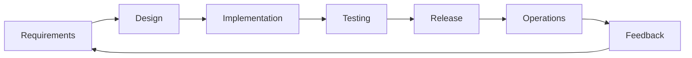
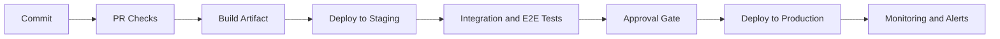

# SDLC and CI/CD

### Build Fast. Ship Safely. Improve Continuously.

 

**Masterclass Overview**

---

## Learning Goals

By the end of this session, you will be able to:

- Explain each SDLC phase and its purpose
- Map quality activities to the right SDLC stage
- Design a practical CI/CD pipeline for a web project
- Add security and performance checks as pipeline gates
- Use metrics to improve delivery speed and reliability

---

## Agenda

1. SDLC foundations
2. CI and CD fundamentals
3. Pipeline architecture
4. Quality, caching, and security gates
5. DORA metrics and continuous improvement
6. End-to-end example workflow

---

## What Is SDLC?

**Software Development Life Cycle (SDLC)** is a structured process for planning, building, testing, releasing, and operating software.

Why it matters:

- Reduces risk and rework
- Improves predictability
- Aligns engineering with business goals
- Makes quality a system, not luck

---

## SDLC Phases

**Key idea:** SDLC is a loop, not a one-time sequence.

---

## Phase 1: Requirements and Planning

Outputs:

- Problem statement and scope
- User stories with acceptance criteria
- Non-functional requirements (security, performance, availability)
- Delivery plan with risks and dependencies

Common failure mode: starting implementation before clear acceptance criteria.

---

## Phase 2: Design and Architecture

Focus areas:

- System boundaries and interfaces
- Data model and API contracts
- Deployment strategy
- Test strategy and quality gates

Design review checklist:

- Is it observable?
- Is it testable?
- Is it secure by default?

---

## Phase 3: Build and Test

Developer workflow:

- Small commits on short-lived branches
- Pull requests with automated checks
- Fast unit tests, then integration tests
- Static analysis and dependency scanning

Rule: if feedback takes too long, quality drops and context is lost.

---

## From SDLC to CI/CD

SDLC defines **what** needs to happen.

CI/CD defines **how** it happens continuously and reliably.

- **CI (Continuous Integration):** merge frequently, validate automatically
- **CD (Continuous Delivery/Deployment):** release safely and often

---

## Continuous Integration (CI)

CI pipeline responsibilities:

- Install dependencies
- Lint and type-check
- Run tests
- Build artifacts
- Report status on every PR

Healthy CI characteristics:

- Deterministic
- Fast
- Trustworthy

---

## Continuous Delivery vs Deployment

**Continuous Delivery**

- Every change is deployable
- Promotion to production is a business decision

**Continuous Deployment**

- Every passing change deploys automatically
- Strong automation and guardrails are mandatory

---

## CI/CD Pipeline Blueprint

---

## Quality Gates That Matter

Minimum gates before production:

- Unit test coverage threshold
- Integration test pass rate
- Lint and type-check must pass
- No critical vulnerabilities
- Build reproducibility verified

Tip: gate only what is high signal, or developers will bypass the system.

---

## Security in the Pipeline (DevSecOps)

Shift-left practices:

- Secret scanning on every commit
- SAST in pull requests
- Dependency and container scanning
- Infrastructure-as-code policy checks

Shift-right practices:

- Runtime monitoring
- Incident response drills

---

## Speed Through Caching and Parallelism

Optimize for fast feedback:

- Cache dependencies and build layers
- Run independent jobs in parallel
- Split test suites by duration
- Reuse build artifacts across stages

Target: PR feedback in less than 10 minutes.

---

## Metrics for Continuous Improvement

Track DORA metrics:

- Deployment Frequency
- Lead Time for Changes
- Change Failure Rate
- Mean Time to Restore

Use metrics to find bottlenecks, not to blame teams.

---

## Example: Web App Workflow

1. Developer opens PR
2. CI runs lint, tests, build
3. Artifact is published
4. Staging deploy happens automatically
5. Smoke and E2E tests run
6. Manual approval for production
7. Production deploy + post-deploy checks

---

## Common Anti-Patterns

- Big-bang releases
- Long-lived branches
- Manual production-only fixes
- No rollback strategy
- Pipeline that is frequently red and ignored

If the pipeline is optional, quality becomes optional.

---

## Implementation Checklist

- Define a clear branching strategy
- Make CI required for merging
- Version and store build artifacts
- Standardize environment configuration
- Add observability to every release
- Run retrospectives on failed deployments

---

## Final Takeaways

- SDLC gives structure to software work
- CI/CD makes that structure executable at scale
- Quality and security must be automated
- Measure, learn, and iterate continuously

### Great teams do not guess quality. They systematize it.

---

## Q&A

What part of your current delivery flow is the biggest bottleneck?
